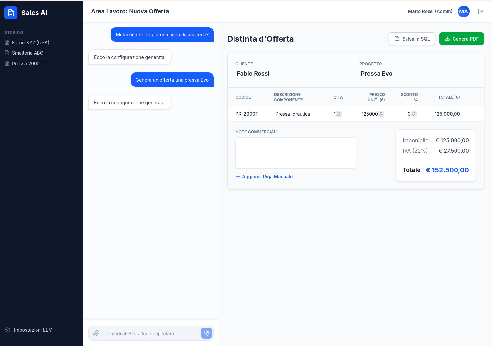

# AI Sales Assistant 🤖💼 - M4rt1n0


Un potente applicativo web enterprise progettato per assistere i commerciali dell'**industria manifatturiera e ceramica** nella generazione rapida di offerte e preventivi strutturati tramite Intelligenza Artificiale (LLM).



## ✨ Funzionalità Principali

*   **Generazione Preventivi AI:** Traduce il linguaggio naturale in una distinta base (JSON) accurata.
*   **Dual LLM Engine:** Compatibilità "Plug & Play" sia con modelli locali (es. **Ollama / Llama3**) per la massima privacy on-premise, sia con modelli cloud enterprise (**Azure OpenAI / GPT-4o**).
*   **Sicurezza Enterprise:** Autenticazione ibrida tramite **Microsoft Entra ID** (SSO) o sistema JWT locale.
*   **Text-to-SQL (RAG):** Si interfaccia con il catalogo prodotti via SQLAlchemy per recuperare listini prezzi reali e impedire allucinazioni sui costi.
*   **Editor Interattivo:** Il commerciale non subisce passivamente l'AI, ma riceve una tabella (distinta base) editabile prima di approvare l'offerta.

## 🛠️ Stack Tecnologico

### Backend (`/backend`)
*   **Framework:** Python 3.11 + FastAPI
*   **AI/Orchestration:** LangChain, Pydantic per output parsing
*   **Database ORM:** SQLAlchemy (Configurato con SQLite per test, pronto per Microsoft SQL Server via `pyodbc`)
*   **Sicurezza:** Passlib (bcrypt), PyJWT

### Frontend (`/frontend`)
*   **Framework:** React 19 + TypeScript + Vite
*   **Styling:** Tailwind CSS v4 + Lucide React (Icone)
*   **Autenticazione:** `@azure/msal-react` (Microsoft Authentication Library)

### Deployment
*   **Containerization:** Docker / Podman
*   **Orchestrator:** Docker Compose

---

## 🚀 Guida all'Avvio (Sviluppo Locale)

### Prerequisiti
*   [Node.js](https://nodejs.org/) (v20+)
*   [Python](https://python.org/) (3.11+)
*   *Opzionale:* [Ollama](https://ollama.com/) in esecuzione locale (`ollama run llama3`) o una chiave Azure/OpenAI.

### 1. Configurazione
Clona il repository e configura le variabili d'ambiente per il backend:
```bash
cp backend/.env.example backend/.env
```
Modifica il file `backend/.env` per scegliere il provider LLM desiderato (`local`, `openai`, o `azure`).

Per il frontend, apri `frontend/src/authConfig.ts` e inserisci il tuo `clientId` di Microsoft Entra ID.

### 2. Avvio Rapido (Script)
Su sistemi Linux/macOS puoi avviare l'intero stack di sviluppo con un solo comando:
```bash
./start.sh
```
*   Frontend: http://localhost:5173
*   Backend API (Swagger): http://localhost:8000/docs
*   *Credenziali locali di test:* `admin@demo.it` / `admin`

---

## 🐳 Produzione (Podman / Docker)

L'applicazione è progettata per essere rilasciata facilmente tramite container, garantendo isolamento e scalabilità.

1.  Assicurati di avere `podman-compose` o `docker-compose` installato.
2.  Esegui lo script di rilascio automatizzato:
```bash
./deploy-podman.sh
```
Il servizio frontend sarà accessibile sulla porta `80` e il database SQLite sarà persistito nella cartella `./data`.

---

## 🧪 Test Automatici
Il progetto include una suite di test completa per il backend (tramite Pytest). I test verificano gli endpoint API, l'estrazione dati mockata dell'AI e il corretto funzionamento dell'ORM.

Per eseguire i test manualmente:
```bash
cd backend
source venv/bin/activate
pytest tests/
```
Questi test sono anche automatizzati tramite **GitHub Actions** a ogni Push o Pull Request sul ramo `main`.

---

## 📂 Struttura del Progetto
```text
.
├── backend/                  # Server FastAPI
│   ├── app/                  # Logica applicativa
│   │   ├── api/              # Endpoint REST (chat, auth)
│   │   ├── core/             # Configurazione e Sicurezza (JWT)
│   │   ├── db/               # SQLAlchemy Models e Seed
│   │   ├── schemas/          # Schemi Pydantic per validazione IO
│   │   └── services/         # Langchain e Prompt Engineering
│   ├── tests/                # Suite di test Pytest
│   ├── Dockerfile            # Immagine container Backend
│   └── requirements.txt      # Dipendenze Python
│
├── frontend/                 # Client React SPA
│   ├── src/                  # Componenti e logica UI
│   │   ├── authConfig.ts     # Setup Microsoft MSAL
│   │   ├── App.tsx           # Dashboard Principale e Chat UI
│   │   └── LoginPage.tsx     # Schermata Login Ibrida
│   ├── Dockerfile            # Immagine container Frontend (Nginx)
│   └── tailwind.config.js    # Configurazione CSS
│
├── .github/workflows/        # Automazioni CI/CD GitHub Actions
├── docker-compose.yml        # Orchestrazione container
├── deploy-podman.sh          # Script per il deploy on-premise
└── start.sh                  # Script per l'avvio dev locale
```

## 📄 Licenza
Progetto privato. Tutti i diritti riservati.
